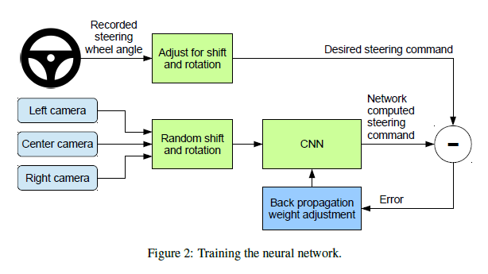
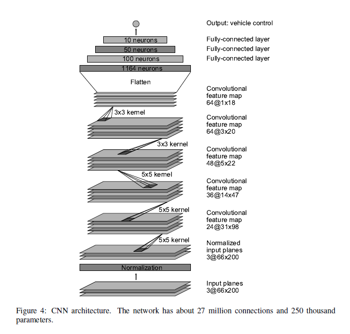
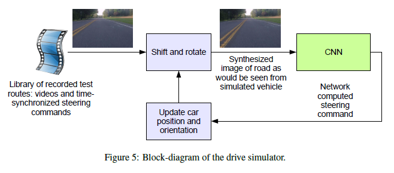
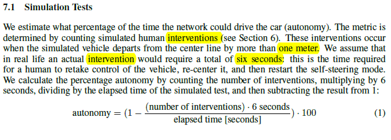
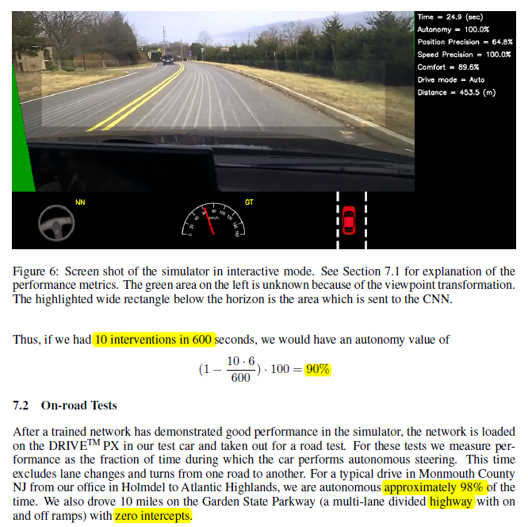
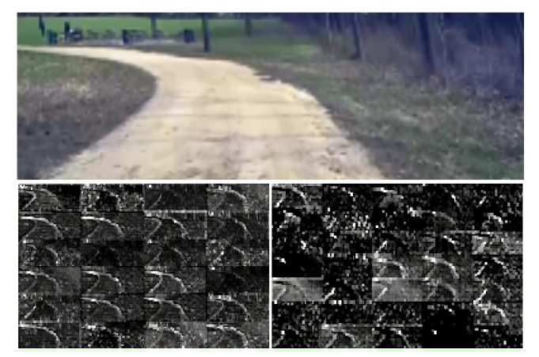
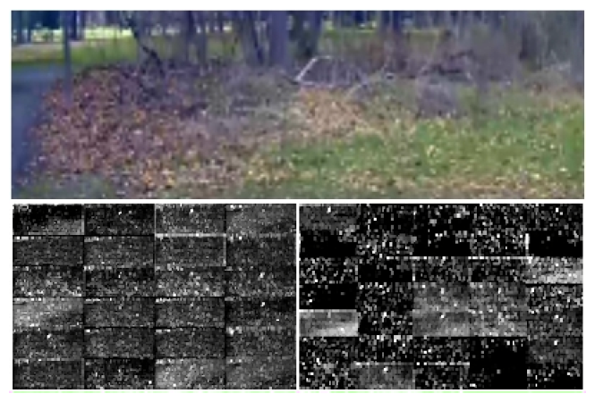

# 自动驾驶DAVE系统 论文阅读总结和讨论

look for [papers for dave](./End+to+End+Learning+for+Self-Driving+Cars.pdf)
contributer : [leoluopy](https://github.com/leoluopy)

+ 如果分享内容对你有帮助和启发，欢迎start / fork / follow 谢谢 ^_^ !
+ 由于知识有限，内容有错误，欢迎请提issue 谢谢 ^_^!
+ 如果对内容有疑问，欢迎提issue 谢谢 ^_^!
+ 如果你最近也有读深度学习相关paper ， 能认识更多志同道合朋友，还不加入分享 ？？   ^_^! 联系微信：leoluopy

# Overview
+ 端到端的解决方案，不需要分解各个步骤列如，感知，定位，规划，控制。 更好的表现，更小的系统。
+ 高速公路0干预，城市公路98%精确度（10分钟需要干预两次）[注： 这是美国城市道路]
+ 三个摄像头采集数据，中间摄像头用于训练，两边摄像头用于数据增广。
+ 仅使用了方向盘数据[1/r] r 为转向半径，学习到了道路信息，比如轮廓，比如其他车辆。
    > 采用倒数是为了避免在车辆直行时，数据为无穷大，不利于训练。
+ 左右摄像头使用，视角近似转换，模拟车辆修正回路中央数据，这是本文的数据增广策略。
    > 另外数据采集还在各种天气下进行，比如大晴天，雨天，阴天，城市，高速，乡村等。
    > 训练数据间隔采用10FPS，太近的帧不具备差异性，容易导致网络过拟合。
+ 输入仅为方向盘控制，没有油门刹车，没有路径规划。 这是他的缺陷，也就是说，只能从固定点到固定点，油门和刹车也需要人控制；
不过虽然有这个缺陷，但是其端到端的做法思路可以用于目前自动驾驶方案的借鉴。
+ loss 采用 mse

## 整体结构

## CNN 卷积网络

+ 一共9层，5层卷积层，3层全连接层，输入图像为YUV，第一层使用数据归一化，未加入训练，归一化后数据更利于网络训练，和BN作用类似。
+ 卷积层主要用于提取道路特征，前三层卷积层，2x2 stride，5x5 kernel ；后两层 3x3 kernel 无stride

## 统计方法及运行时态

## 卷积层可视化

从可视化可见，没有道路轮廓的标注等信息，网络学习到了，道路信息。

从可视化可见，前方无路时，网络呈现出全部是噪音。

