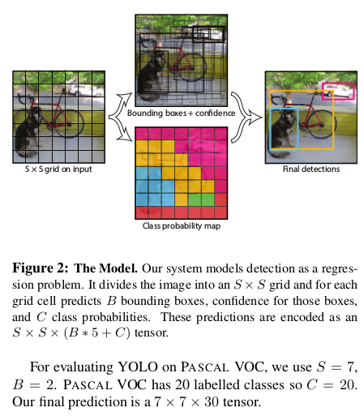
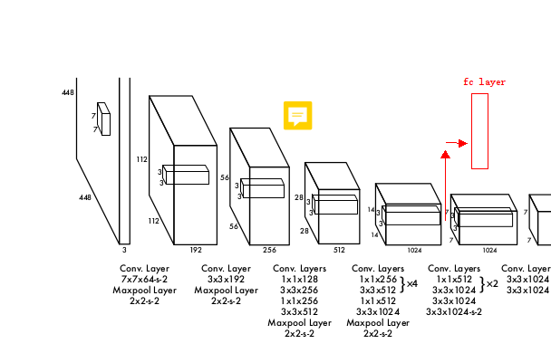

# YOLO V1 

look for [papers for yolo1](https://github.com/leoluopy/paper_discussing/blob/master/yolo/yolo1/yolo_1.pdf)
contributer : [leoluopy](https://github.com/leoluopy)

# Overview

+ 首个OneStage网络（SSD也是）regression思路
+ 学习特征是泛化能力特别强特征(在艺术画上泛华能力仍然较强，对比同时期RCNN，RCNN在艺术画识别能力大幅下降)
+ 速度极快（多个子类型网络达到实时）
+ 摒弃滑窗或候选框，直接全局回归目标位置和分类

## 结构综述

图像首先分为SxS 个网格，在不同数据集和不同场景下可以设置不同S。对于每个网格预测B个Box和每个Box是否有对象。
另外对于每个网格仅预测一个类，而不是每个网格都预测类。

>这也是yolo1的弱点，每个网格只有一个类，如果多个类在同一个网格，那么就会出现漏检，特别是小目标。。

每一个BoundingBox回归的是（x，y，w，h）还有一个confidence：代表是否有对象的置信度。

+ 因此他全连接层最后的tensor 为： （B×5 +C ）× S × S

## 预测置信度计算公式：

对应类概率 × 有无对象概率 × 预测box和真实box比值 = 最终预测置信度

## 网络设计

设计主思路：替换掉了inception module的思想，代替使用： 1x1降低特征空间 ； 3x3提取特征；两种卷积交替使用 再配合 MaxPooling 降维特征图。最后接两层全连接层，得到预测tensor

> NOTE： 后面 7x7x30 是在VOC这个数据集上的特例，作者使用了 7x7个网格，每个网格 2个Box 和 20个类 也就是（ 7x7x（2x5+20））= （7x7x30）.
在表示方法上全连接层可以被看做特殊的卷积层，上图把最后的全连接层画成了更容易理解的7x7x30 tensor形状。

> 另外作者还提供了tradeoff，更快的YOLO1网络：用9层卷积层替换24层卷积层

## 模型预训练

为了获取一个更强的特征提取器，以及更强的泛化能力，作者使用了ImageNet对网络的前20层进行了分类器训练，训练过程从MaxPooling那层截断，
随后加入训练所需要的全连接层。在训练一周后得到了在ImageNet上，top5：88% 的结果。截取方法如上图所示。

