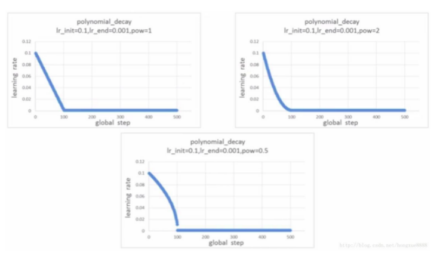

# YOLO V2 论文阅读总结和讨论

look for [papers for yolo2](https://github.com/leoluopy/paper_discussing/blob/master/yolo/yolo2/YOLO9000.pdf)
contributer : [leoluopy](https://github.com/leoluopy)

+ 如果分享内容对你有帮助和启发，欢迎start / fork / follow 谢谢 ^_^ !
+ 由于知识有限，内容有错误，欢迎请提issue 谢谢 ^_^!
+ 如果对内容有疑问，欢迎提issue 谢谢 ^_^!
+ 如果你最近也有读深度学习相关paper ， 能认识更多志同道合朋友，还不加入分享 ？？   ^_^! 联系微信：leoluopy

# Overview

+ 提出一种新型半监督的学习方法未标注boundingBox的分类图像来学习box检测任务
+ yolo1的升级版本，更快，更准。

## 结构综述

结构与[yolov1](../yolo1/yolo1_discussing.md)类似，但是提出了改进。网络支持多种分辨率，采用了全卷积网络，在不同数据集和不同场景下可以设置不同S。

|输入分辨率| 最终特征图 |
|:---:| :---: |
|416|13x13|
|448|14x14|
|480|15x15|
|512|16x16|
|608|19x19|

对于预测时的tensor如下图所示：

对于每个网格预测B个Box和每个Box是否有对象。另外对于每个网格仅预测一个类，而不是每个网格都预测类。

>这也是yolo1的弱点，每个网格只有一个类，如果多个类在同一个网格，那么就会出现漏检，特别是小目标。。

每一个BoundingBox回归的是（x，y，w，h）还有一个confidence：代表是否有对象的置信度。

> w 和 h 被回归到原图像的比例 【0,1】 之间 ， x，y 被回归为对应 网格的 offset 也在 【0,1】 之间

+ 因此他全连接层最后的tensor 为： （B×5 +C ）× S × S

## 模型及训练方法

darknet19
+ 类似VGG模型，3x3卷积提取特征，在pool层降维后扩充特征提取深度至filter数2倍。在feature压缩上仍然使用1x1卷积，和yolo1一致。
+ 每个卷积层后加入BN，加速梯度下降。
+ 224 分辨率分类网络训练： 72.9% top-1 accuracy and 91.2% top-5 accuracy on ImageNet
+ 224 网络训练方法：
    * 160 epochs , momentum SGD优化方法
    * 
    * 起始学习率 0.1,多项式衰减 power：4 ，decay： 0005  ， momentum ： 0.9
+ 448 分辨率分类网络训练： a top-1 accuracy of 76.5% and a top-5 accuracy of 93.3%
+ 图像增广方法：中心裁剪, 图像旋转, 色相调整, 饱和调整, 曝光调整
## 性能与速率提升

+ BN
+ 预训练分辨率提升
+ AnchorBox
+ 先验框聚类
+ 细粒度特征
+ 多尺度训练
+ 分类器训练
+ 检测器训练

